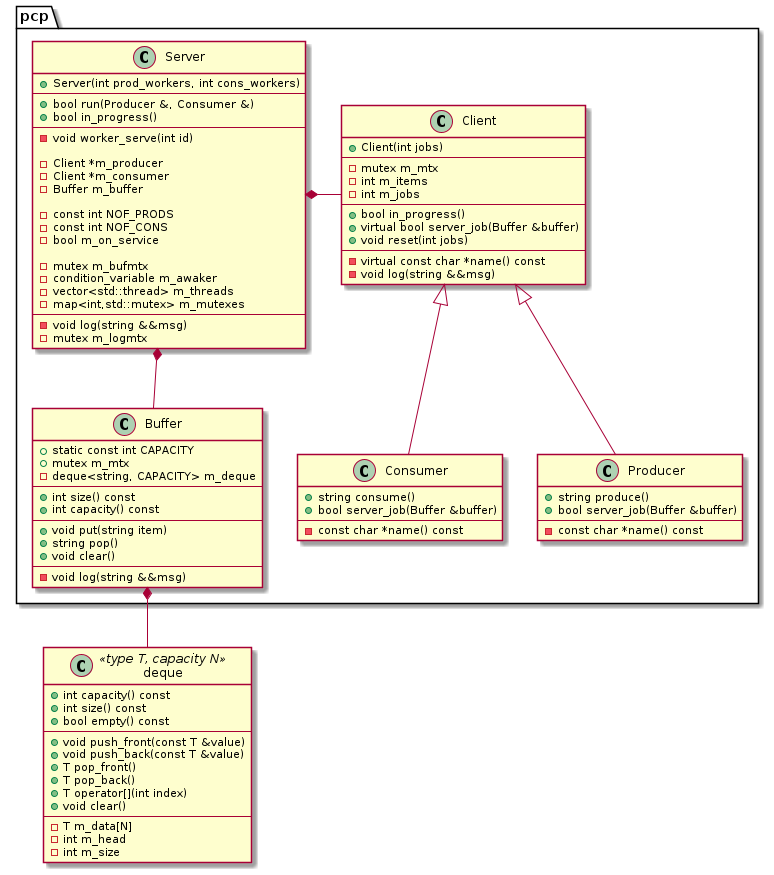

# Changelog
Producer-Consumer Problem sandbox

## [Unreleased]

## [0.0.1] - 2021-09-16

### Descr
`pcp-classes` update includes:  
- [deque](../src/deque.hpp) minor upgrades
- draft version of thread-safe [logger](../src/logger.hpp)  
- Prod-Cons problem split into object units in namespace `pcp`. See more in [Diagram](#Diagram) section below.  

### Changed
- [deque](../src/deque.hpp): added `clear` function, optimised indexation by mod  

### Added
- [src](../src/) dir:
    - [buffer](../src/pcp-buffer.hpp), [client](../src/pcp-client.hpp), [server](../src/pcp-server.hpp) modules in `pcp` namespace
- [doc](.) dir:
    - this `CHANHELOG.md`
    - [diagrams](diagrams/) dir:
        - [Makefile](diagrams/Makefile) for image generation
        - [global.skin](diagrams/global.skin) for PlantUML configs
        - [src](diagrams/src) dir (for uml source files):  
            - [pcp-classes.puml](diagrams/src/pcp-classes.puml)
        - [img](diagrams/img) dir (for diagrams output):  
            - [pcp-classes.png](diagrams/img/pcp-classes.png)
- [CMakeLists.txt](../CMakeLists.txt)
- [build.sh](../build.sh)  

### Diagram

  

### TODO
- tests
- make the current model data agnostic
- extend the Server to work with multiple producers/consumers
- upgrade or replace the current logger to reduce blocking